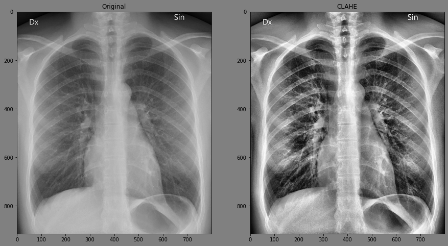

# Tensorflow CLAHE


Contrast-limited adaptive histogram equalization implemented in tensorflow ops.

## Setup

```bash
pip install tf_clahe
```

## Use

```python
import tensorflow as tf
import tf_clahe

img = tf.io.decode_image(tf.io.read_file('./path/to/your/img'))
img_clahe = tf_clahe.clahe(img)
```


## Optimizing for GPU with XLA

A considerable performance improvement can be achieved by using the `gpu_optimized` flag 
in combination with XLA compilation. For example:

```python
import tf_clahe
import tensorflow as tf

@tf.function(experimental_compile=True)  # Enable XLA
def fast_clahe(img):
    return tf_clahe.clahe(img, gpu_optimized=True)
```
## References

- [S. M. Pizer, E. P. Amburn, J. D. Austin, et al.: Adaptive Histogram Equalization and Its Variations. Computer Vision, Graphics, and Image Processing 39 (1987) 355-368.](https://www.cs.unc.edu/Research/Image/MIDAG/pubs/papers/Adaptive%20Histogram%20Equalization%20and%20Its%20Variations.pdf)
- [Wikipedia: Adaptive Histogram Equalization](https://en.wikipedia.org/wiki/Adaptive_histogram_equalization#Contrast_Limited_AHE)